# Deploy Consul On Red Hat Openshift Cluster
## Prerequisites

- Openshift Cluster.
- Redhat Account.
- [Helm v.3.2.1+](https://helm.sh/docs/helm/helm_install/)


## Step to deploy
### 1. Create New Project in Openshift
Create an new Openshift project to install consul. Ex : consul
```
oc new-project consul
```
### 2. Create an image pull secret for Redhat Registry and make sure can pull image
Create an image pull secret to give authentication so we can pull image from Redhat Registry(we are using ```registry.connect.redhat.com```). You can create it on [RedHat Customer Portal](https://access.redhat.com/terms-based-registry/). Then apply yaml file to Openshift on consul project.
```
oc create -f openshift-secret.yml --namespace=consul
```
Make sure we can pull image from ```registry.connect.redhat.com``` by see allowed registry section in ```image.config.openshift.io/cluster```. We can edit using this command(reference to : https://docs.openshift.com/container-platform/4.10/openshift_images/image-configuration.html);
```
oc edit image.config.openshift.io/cluster
[..]
spec:
registrySources:
  allowedRegistries:
  - quay.io
  - registry.redhat.io
  - registry.connect.redhat.com
```
:warning: ``WARNING!!! AFTER EDIT THIS RESOURCE  YOU NEED TO WAIT FOR MCP!!!``
### 3. Deploy consul using helm
Create yaml configuration with name values.yaml(more explanation [values.yaml](consul/values.yaml)):
```
global:
  name: consul
  datacenter: dc1
  image: registry.connect.redhat.com/hashicorp/consul:1.13.2-ubi
  imageK8S: registry.connect.redhat.com/hashicorp/consul-k8s-control-plane:0.49.0-ubi
  imagePullSecrets:
    - name: 15156148-consul-pull-secret
  openshift:
    enabled: true
  gossipEncryption:
    autoGenerate: true
  metrics:
    enabled: true
    enableAgentMetrics: true
    agentMetricsRetentionTime: "1m"

server:
  replicas: 1
  bootstrapExpect: 1
  disruptionBudget:
    enabled: true
    maxUnavailable: 0

client:
  enabled: true
  grpc: true

ui:
  enabled: true
  metrics:
    enabled: true
    provider: "prometheus"
    baseURL: http://prometheus-server

connectInject:
  enabled: true
  default: false
  transparentProxy:
    defaultEnabled: true
  metrics:
    defaultPrometheusScrapePort: 20200
    defaultPrometheusScrapePath: "/metrics"
    defaultMergedMetricsPort: 20100

controller:
  enabled: true

prometheus:
  enabled: true
```
Prepare our helm chart by adding hashicorp/consul chart:
```
helm repo add hashicorp https://helm.releases.hashicorp.com

#verify repo already added
helm search repo hashicorp/consul

#if version is incorrect, update helm repo
helm repo update
```
Install consul using helm command with values.yaml:
```
helm install consul hashicorp/consul --values values.yaml --create-namespace --namespace consul --version "0.49.0" --wait
```
If succeed, the output will be similar to the following:
```
NAME: consul
LAST DEPLOYED: Thu Nov 17 11:00:16 2022
NAMESPACE: consul
STATUS: deployed
REVISION: 1
NOTES:
Thank you for installing HashiCorp Consul!

Your release is named consul.
```
### 4. Verify installation
Open openshift web console, than see pods at consul namespace. There should be consul pods simillar to following:

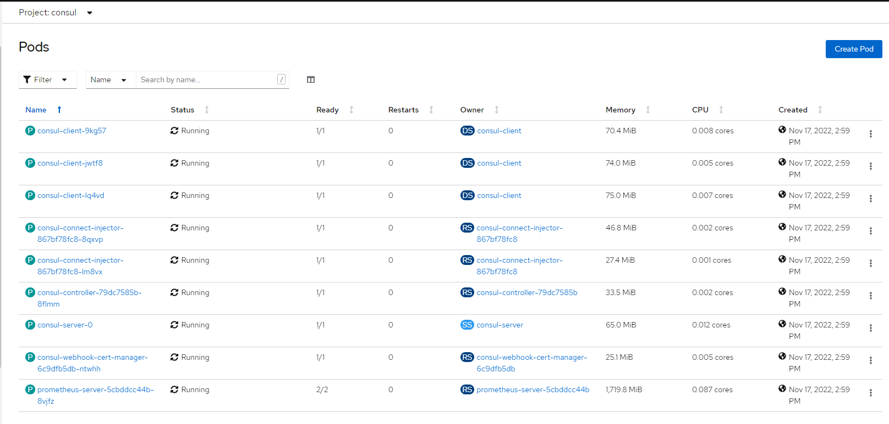

Or from cli:
```
oc get pods -n consul
NAME                                          READY   STATUS    RESTARTS   AGE
consul-client-9kg57                           1/1     Running   0          78m
consul-client-jwtf8                           1/1     Running   0          78m
consul-client-lq4vd                           1/1     Running   0          78m
consul-connect-injector-867bf78fc8-8qxvp      1/1     Running   0          78m
consul-connect-injector-867bf78fc8-lm8vx      1/1     Running   0          78m
consul-controller-79dc7585b-8flmm             1/1     Running   0          78m
consul-server-0                               1/1     Running   0          78m
consul-webhook-cert-manager-6c9dfb5db-ntwhh   1/1     Running   0          78m
prometheus-server-5cbddcc44b-8vjfz            2/2     Running   0          78m
```
### 5. Access consul UI
Expose consul-server service in openshift.

From Openshift Web UI

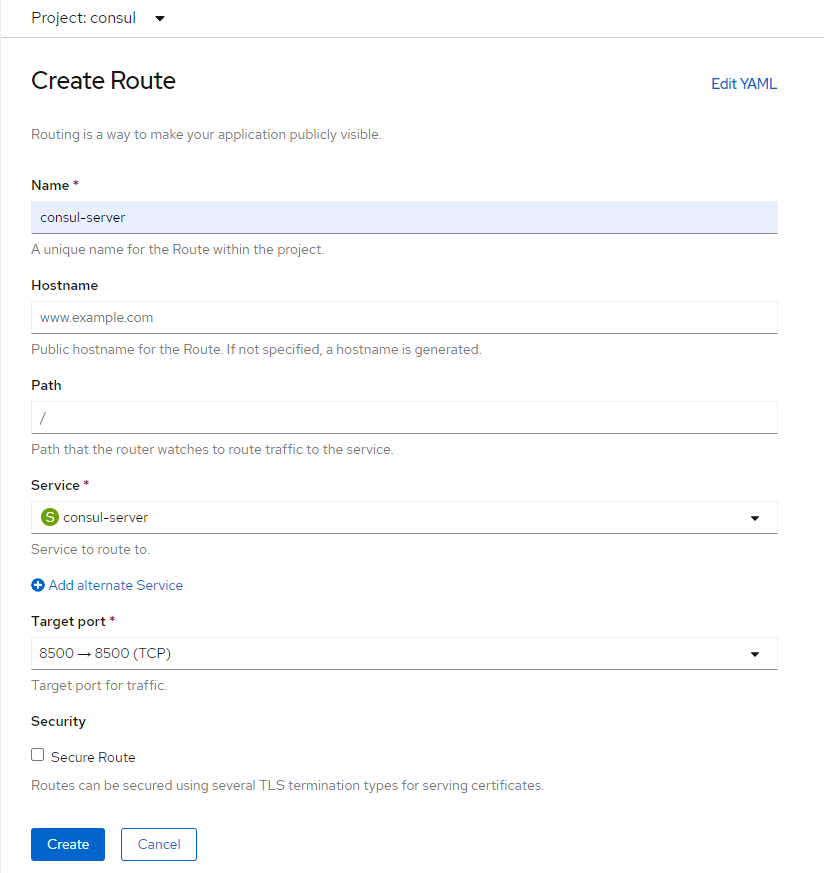
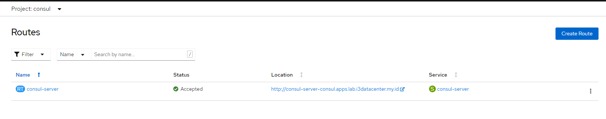

From CLI
```
oc expose svc/consul-server
oc get route
NAME            HOST/PORT                                          PATH   SERVICES        PORT   TERMINATION   WILDCARD
consul-server   consul-server-consul.apps.lab.i3datacenter.my.id          consul-server   http                 None
```
Open consul web UI via openshift route

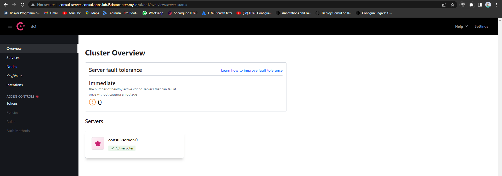

For more information, go to [consul-ui](consul/)

### 6. Deploy example service for service mesh
Create new project ``demo-consul``. Create ``web.yaml`` and ``api.yaml``
More explanation for web.yaml and api.yaml [here](demo-consul/)

``web.yaml``
```
apiVersion: v1
kind: ServiceAccount
metadata:
  name: web
---
apiVersion: v1
kind: Service
metadata:
  name: web
spec:
  selector:
    app: web
  ports:
    - port: 9090
      targetPort: 9090
---
apiVersion: apps/v1
kind: Deployment
metadata:
  name: web-deployment
  labels:
    app: web
spec:
  replicas: 1
  selector:
    matchLabels:
      app: web
  template:
    metadata:
      labels:
        app: web
      annotations:
        consul.hashicorp.com/connect-inject: 'true'
        consul.hashicorp.com/transparent-proxy-exclude-inbound-ports: '9090'
    spec:
      containers:
        - name: web
          image: nicholasjackson/fake-service:v0.7.8
          ports:
            - containerPort: 9090
          env:
            - name: 'LISTEN_ADDR'
              value: '0.0.0.0:9090'
            - name: 'UPSTREAM_URIS'
              value: 'http://api-v1:9091'
            - name: 'NAME'
              value: 'web'
            - name: 'MESSAGE'
              value: 'Hello World'
```

``api.yaml``
```
apiVersion: v1
kind: ServiceAccount
metadata:
  name: api-v1
---
apiVersion: v1
kind: Service
metadata:
  name: api-v1
spec:
  selector:
    app: api-v1
  ports:
    - port: 9091
      targetPort: 9091
---
apiVersion: apps/v1
kind: Deployment
metadata:
  name: api-v1
  labels:
    app: api-v1
spec:
  replicas: 1
  selector:
    matchLabels:
      app: api-v1
  template:
    metadata:
      labels:
        app: api-v1
      annotations:
        consul.hashicorp.com/connect-inject: 'true'
    spec:
      containers:
        - name: api
          image: nicholasjackson/fake-service:v0.7.8
          ports:
            - containerPort: 9091
          env:
            - name: 'LISTEN_ADDR'
              value: '0.0.0.0:9091'
            - name: 'NAME'
              value: 'api-v1'
            - name: 'MESSAGE'
              value: 'Response from API v1'
```
Deploy web and api app to Openshift:
```
oc apply -f web.yaml -n demo-consul
oc apply -f api.yaml -n demo-consul
```

Check pods for web and api

```
oc get pods -n demo-consul
NAME                              READY   STATUS      RESTARTS   AGE
api-v1-6f75646bcc-j8jmk           2/2     Running     0          44m
web-deployment-5dc8f56458-7kzvc   2/2     Running     0          48m
```

See consul UI to check if web and api-v1 service already discovered:

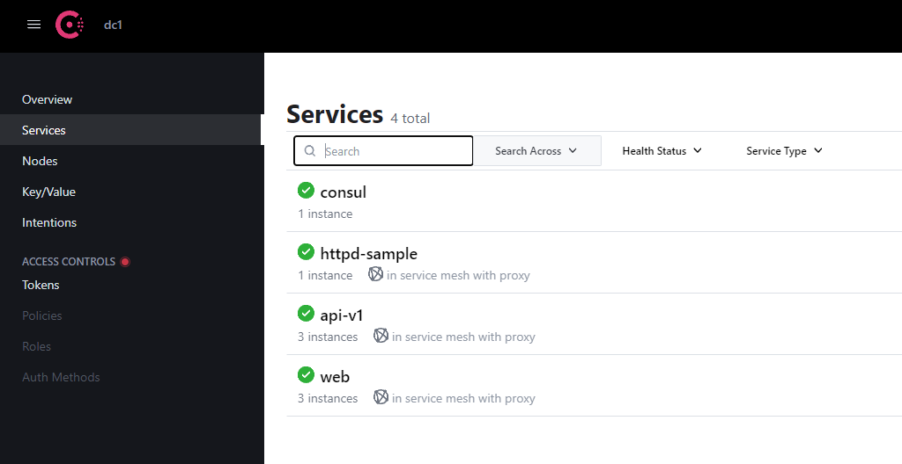

Create intention in consul UI. Intention used to define communication between services

1. Deny All Intention

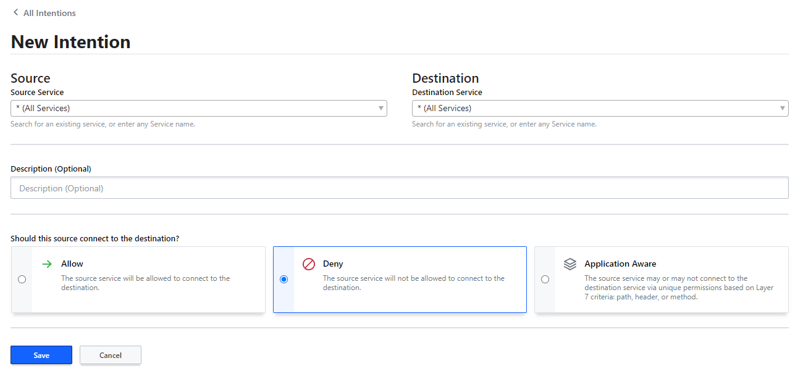

2. Allow web to api-v1 intention

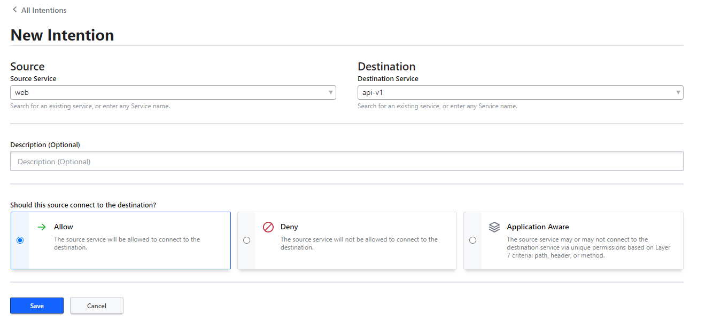

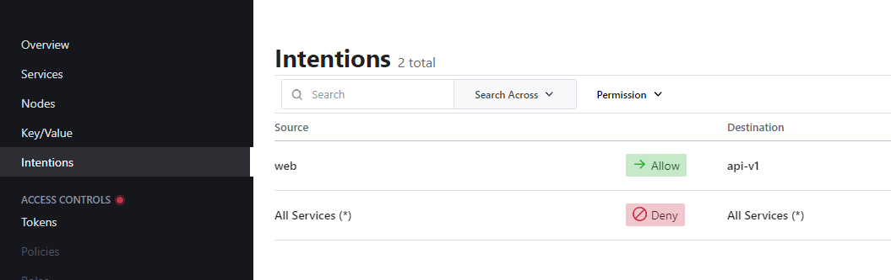

We can see topology for our services

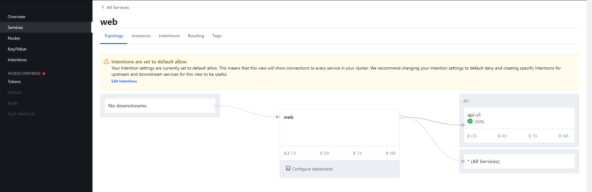

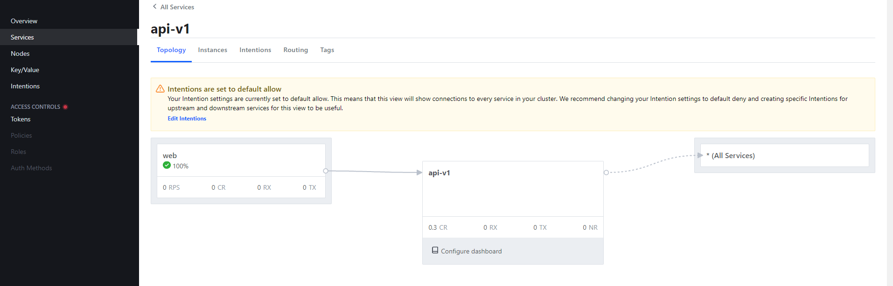

Expose web service

From Openshift UI

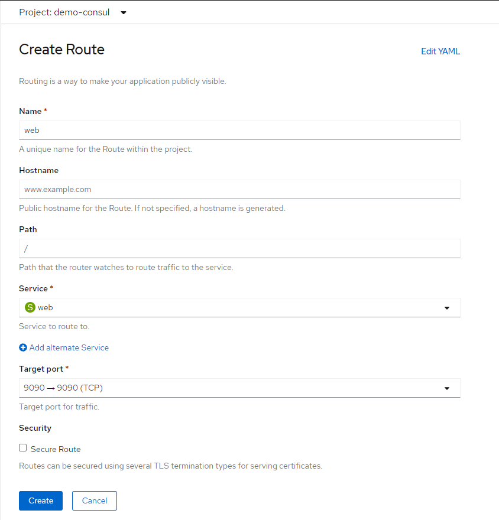

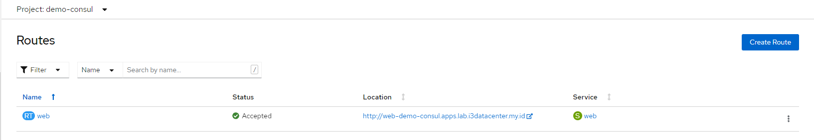

From CLI
```
oc expose svc/web-deployment

oc get route
NAME           HOST/PORT                                              PATH   SERVICES       PORT     TERMINATION   WILDCARD

web            web-demo-consul.apps.lab.i3datacenter.my.id                   web            9090                   None
```

Try access web service via openshift route

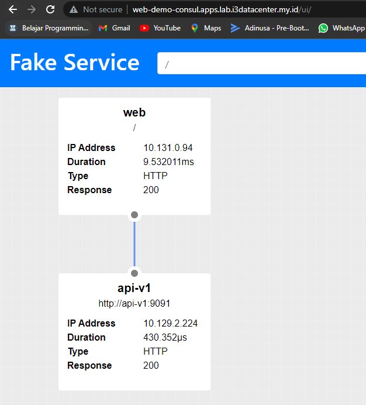

Try to edit intentions so web service can't communicate with api-v1 service

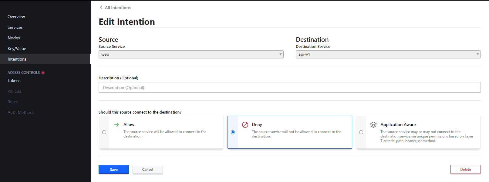

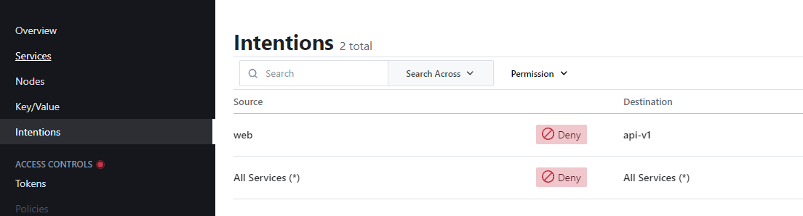

Try access again web service

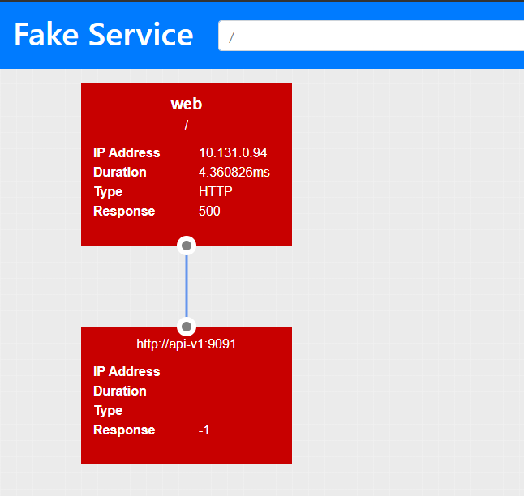
