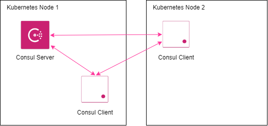
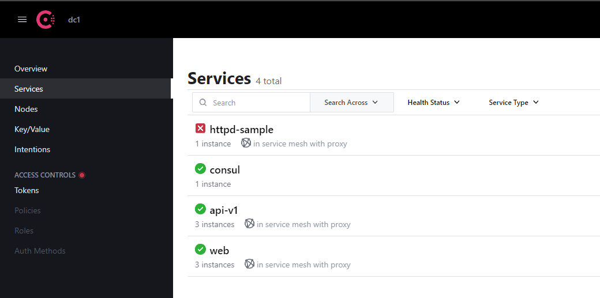
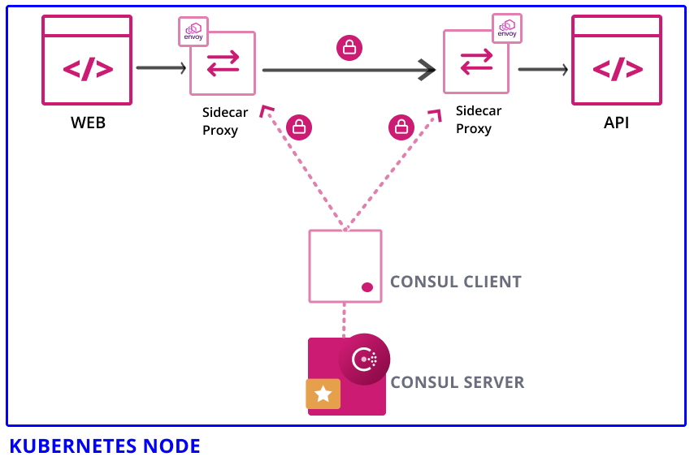
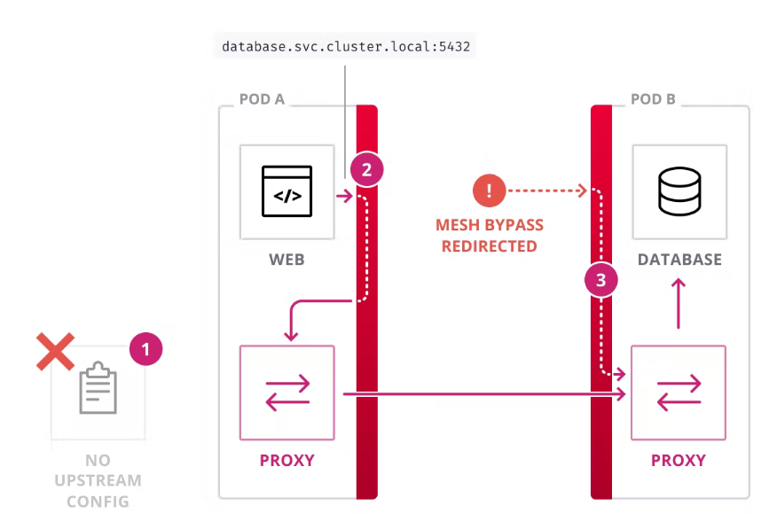
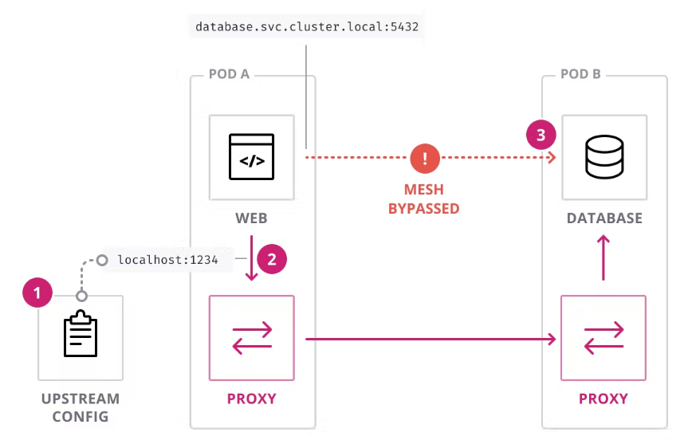

# More Explanation For Consul
## Consul Topology in Kubernetes



When we install our consul in kubernetes cluster, consul will first make Consul Server pod to become master and create consul cluster. After that, consul will deploy each Consul Client pod on kubernetes worker node (deploy to master node too if can). Each Consul Client pod will communicate to Consul Server to make worker node join the consul cluster. Consul Server and Consul Client will communicate to each other to maintain connection.

## How Consul Discover Services
Whenever there is a new pod with right annotation (if connectInject default is enabled there is no need for annotation), consul will make init container to check if the pod have service available and tell there is service in that node. This init container will fail if there is no service available for that pod. We can see discovered service in Consul Web UI.



:x: means there is failed pods in this service.

:white_check_mark: means all pods is up in this service.

## Consul Service Mesh, Explanation for Transparent Proxy

Services in consul, communicate with each other using a sidecar proxy. This sidecar proxy is injected to the pod as a container with name envoy-sidecar.



This sidecar proxy is used to secure communication between services.

There are two options to manage this service mesh:
### 1. Transparent Proxy Enabled



In the values.yaml file, define ``transparentProxy`` default enabled to enable transparent proxy. 

When we enable the Transparent Proxy, consul will force all inbound and outbound traffic in each service through sidecar proxy.

Let see the picture. In this scenario we have two pod, web and database. We want web pod to be able communicate with database pod using database service. Because transparent proxy is enabled, in web pod, just call database service and consul will automatically redirect it to sidecar proxy. Of course we should define an intentions so web can communicate with database.

### 2. Transparent Proxy Disabled



In the values.yaml file, define ``transparentProxy`` default disabled to disabled transparent proxy.

Same like before, we want web pod to be able communicate with database pod using database service. But, we must manually specify the configurations because we disable the transparent proxy:

1.  Configure Upstream Config in web pod. Add this annotations ``consul.hashicorp.com/connect-service-upstreams: '<service-name>:<chosen-port>'``
2.  Make sure database pod can only be access from loopback interface (127.0.0.1). We need to configure this, because consul don't force inbound and outbound traffic in services through sidecar proxy.
3.  Make web pod call database service using ``localhost:<chosen-port>`` 

## Explanation for Values.yaml
## Global
To define our consul such as name, images, secret, metrics, etc.

```
global:
  #Consul Name
  name: consul

  #Consul Data Center Name for Multiple DC
  datacenter: dc1

  #Image for consul
  image: registry.connect.redhat.com/hashicorp/consul:1.13.2-ubi

  #Image for consul control plane
  imageK8S: registry.connect.redhat.com/hashicorp/consul-k8s-control-plane:0.49.0-ubi

  #Openshift Secret used to pull image
  imagePullSecrets:
    - name: 15156148-consul-pull-secret

  #To tell consul run on openshift
  openshift:
    enabled: true

  #For encryption
  gossipEncryption:
    autoGenerate: true

  #To activate metrics
  metrics:
    enabled: true
    enableAgentMetrics: true
    agentMetricsRetentionTime: "1m"
```

## Server
To define consul-server such as replicas

```
server:
  #How many replica consul-server pod running
  replicas: 1

  #To elected first consul-server
  bootstrapExpect: 1

  #Configure PodDisruptionBudget in kubernetes
  disruptionBudget:
    enabled: true
    maxUnavailable: 0
```

## Client
To enable consul-client for node in Openshift join to consul-server using GRPC

```
client:
  enabled: true
  grpc: true
```

## UI
To enable consul web UI.

```
ui:
  enabled: true

  #To enable metrics in consul-ui using prometheus
  metrics:
    enabled: true
    provider: "prometheus"
    #Prometheus service URL, can use openshift prometheus if wanted
    baseURL: http://prometheus-server
```
## connectInject
To enable sidecar proxy injection so consul can discover services

```
connectInject:
  #To activate connectInject
  enabled: true

  #So not all pod injected
  default: false

  #To activate transparent proxy consul
  transparentProxy:
    defaultEnabled: true

  #To activate metrics in sidecar proxy
  metrics:
    defaultPrometheusScrapePort: 20200
    defaultPrometheusScrapePath: "/metrics"
    defaultMergedMetricsPort: 20100
```

## Controller
To activate consul-controller for configure custom resources in Openshift

```
controller:
  enabled: true
```

## Prometheus
To deploy prometheus pod for metrics

```
prometheus:
  enabled: true
```